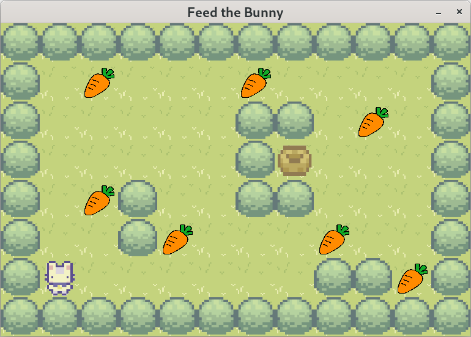

# so_long
A 2D game - Feed the bunny

People love games... and they love CUTE games even more.  
-> and here it is!  

Go through the game, You are a Bunny🐰 and you have to Collect your Carrots🥕.  

What are you waiting for, the carrots won't collect themselves!😸  

*********************************************************************************
**How to run**:  
Pass in a map file (map_1.ber, map_2.ber, map_3.ber) into the program.  
./so_long maps/map_1.cub 

  

*********************************************************************************
**Technical info**:  
The game uses MLX42 as a graphics library. 
https://github.com/codam-coding-college/MLX42  

It also requires cmake (compilation) and glfw (graphics).  
